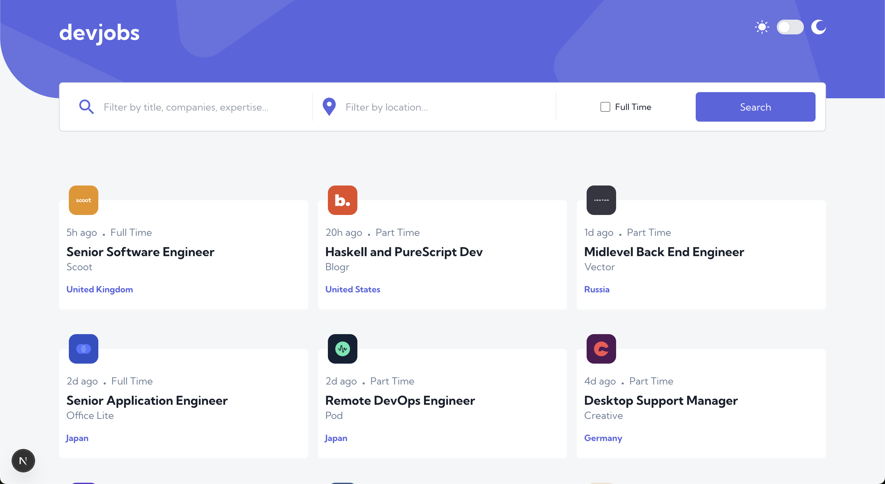
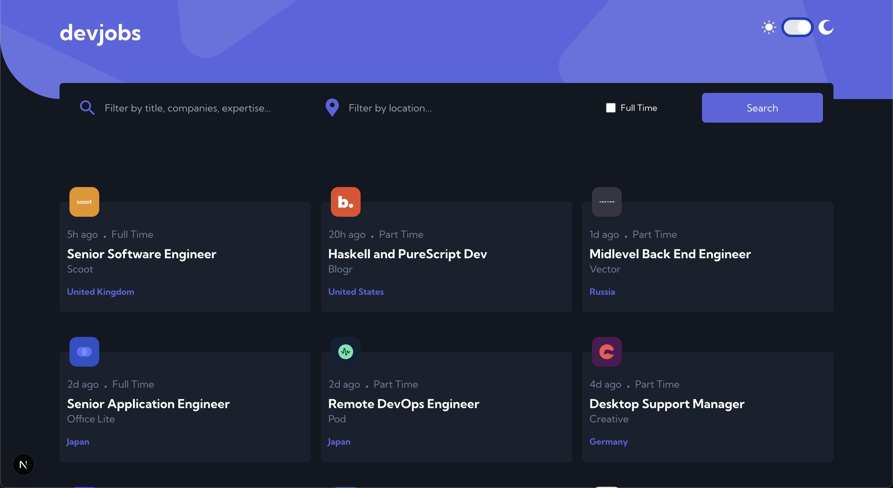

# Frontend Mentor - Devjobs web app solution

This is a solution to the [Devjobs web app challenge on Frontend Mentor](https://www.frontendmentor.io/challenges/devjobs-web-app-HuvC_LP4l). Frontend Mentor challenges help you improve your coding skills by building realistic projects.

## Table of contents

- [Overview](#overview)
  - [The challenge](#the-challenge)
  - [Screenshot](#screenshot)
  - [Links](#links)
- [My process](#my-process)
  - [Built with](#built-with)
  - [What I learned](#what-i-learned)
  - [Continued development](#continued-development)
- [Author](#author)

## Overview

### The challenge

Users should be able to:

- View the optimal layout for each page depending on their device's screen size
- See hover states for all interactive elements throughout the site
- Be able to filter jobs on the index page by title, location, and whether a job is for a full-time position
- Be able to click a job from the index page so that they can read more information and apply for the job
- **Bonus**: Have the correct color scheme chosen for them based on their computer preferences. _Hint_: Research `prefers-color-scheme` in CSS.

### Screenshot




### Links

- Live Site URL: [Add live site URL here](https://your-live-site-url.com)

## My process

### Built with

- Semantic HTML5 markup
- CSS custom properties
- Flexbox
- CSS Grid
- Mobile-first workflow
- [React](https://reactjs.org/) - JS library
- [Next.js](https://nextjs.org/) - React framework
- [Tailwind CSS](https://tailwindcss.com/) - For styles
- [Zustand](https://zustand-demo.pmnd.rs/) - For state management

### What I learned

Use this section to recap over some of your major learnings while working through this project. Writing these out and providing code samples of areas you want to highlight is a great way to reinforce your own knowledge.

To see how you can add code snippets, see below:

In this code snippet, I learned how to use Zustand for state management in a React application. Zustand is a small, fast, and scalable bearbones state-management solution that can be used with React.

```ts
create<X>((set) => ({
```

### Continued development

- I plan to integrate a backend API to fetch job listings dynamically.
- I plan to implement user authentication to allow users to save their favorite job listings.
- I plan to add a search functionality to filter job listings based on user input.

## Author

- Frontend Mentor - [@kurniawan26](https://www.frontendmentor.io/profile/kurniawan26)
